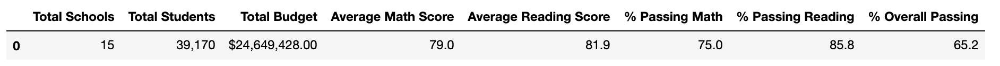
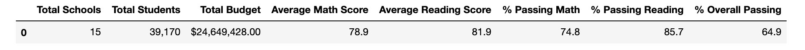
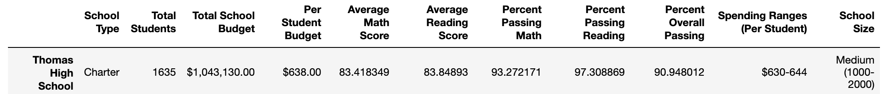
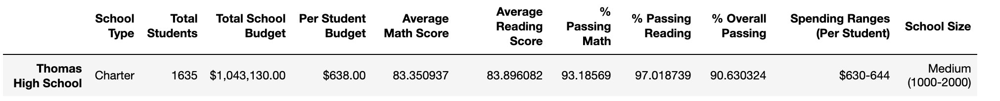
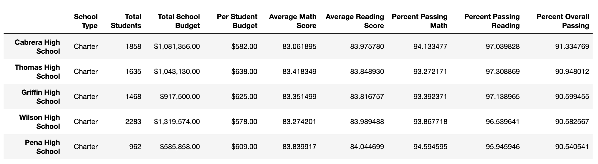
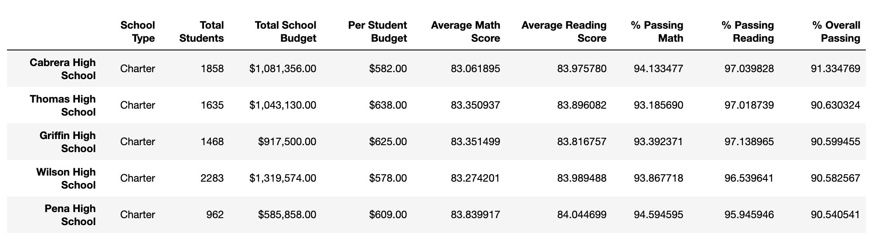
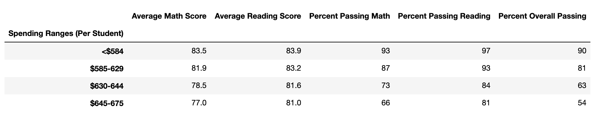
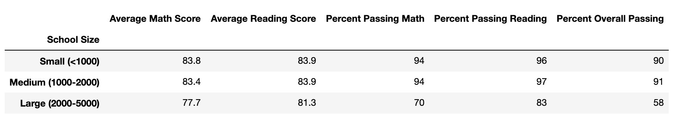
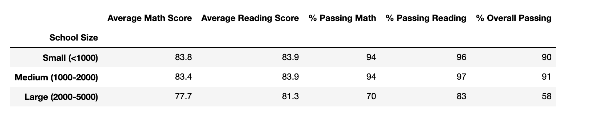
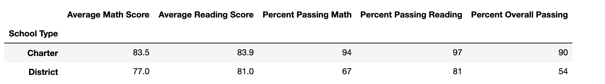

# School District Analysis
Analyzing a school district's data
## Overview of the Project
The goal of this project was to analyze the school district's data regarding test scores, school size, school type, and school budget. The analysis was done on all the data for the school district, but then was repeated to exclude the test scores of 9th graders from Thomas High School because of a cheating issue.
## Results
After repeating the district analysis and excluding the 9th grade test scores from Thomas High School, the original results were impacted. Details of the impacts are listed here. 
* District Summary
The original district summary is very slightly eafected by the score removal from Thomas High School. The average math score, percent of students passing math, and percent of students passing both reading and math are all slightly lower.  
Original District Summary:  
  
  
Modified District Summary:

  
* School Summary. 
The individual school summaries are the same for every school except Thomas High School. The math and reading scores are slightly lower after the removal of the ninth grade scores, and the percentage of students passing is slightly lower.   
Original District Summary:  
  

Modified District Summary:  

* Thomas High School Ranking
Because the change in scores for Thomas High School is so small, it retains its spot as number 2 in the ranking of the top five schools based on test score performance.  
Original Top Five Ranking:
. 

Modified Top Five Ranking:

  
* Math and reading scores by grade
The math and reading scores by grade were the same for all schools and grades, except the Thomas High School ninth graders. Instead of average reading and math scores, Thomas High School ninth graders have null values in those columns. 
Original Math and Reading Scores:  
  
 

Modified Math and Reading Scores:  
  
  

* Scores by school spending
The scores by school spending were unchanged with the modification of the ninth grade scores. This is likely because the changes in average test scores was so small for Thomas High School.  
Original Scores by School Spending:  
  
Modified Scores by School Spending:  
  

* Scores by school size  
The scores by school size were also unchanged, likely for the same reasons as the scores by school spending.  
Original Scores by School Size:  
  
Modified Scores by School Size:  
  

* Scores by school type
The scores by school type were also unchanged.  
Original Scores by School Type:  
  
Modified Scores by School Type:  

## Summary
There is a statement summarizing four major changes to the school district analysis after reading and math scores have been replaced (5 pt).
In summary, the main four changes to the school district analysis are: 
* The school district summary is slightly different, with lower reading and math score averages and a lower percentage of students passing reading and math. 
* The average scores for Thomas High School are slightly lower, as are its percentage of students passing reading and math. 
* The average scores by grade level have no value for Thomas High School ninth graders for math and reading. 
* Thomas High School is the same ranking as before modifying the values, but with a slightly lower margin. 

